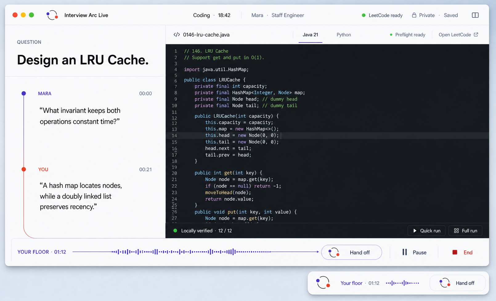
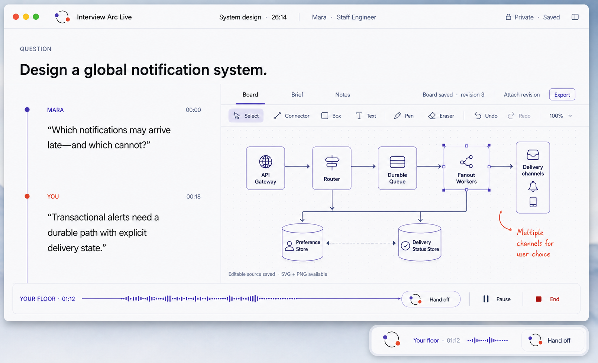
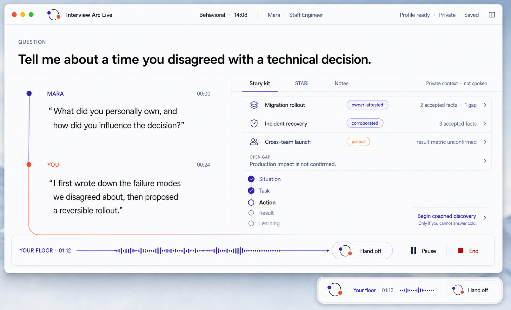

# Specialty Room Concepts

Status: design exploration for [issue #1](https://github.com/Vinosaamaa/interview-arc-live/issues/1). These concepts define the intended specialty surfaces; they do not expand the first implementation slice without a separate approval.

## Shared room shell

All specialties are projections of one active `InterviewRoomSession`. Changing the room presentation must not restart capture, model work, speech, transcript streaming, or persistence.

- The Live mark is two asymmetric open arcs with one moving handoff point. A microphone icon is reserved for literal permission, mute, or input-device controls; it is not the Live product mark.
- The transcript uses role-tagged typographic blocks on one continuous Turnline, not chat bubbles.
- The current question is the visual anchor. Prior turns recede without disappearing.
- `Hand off` is the single primary action in patient half-duplex mode. It ends the candidate's floor and permits the interviewer to answer.
- The compact capsule is another presentation of the same session and phase. It never creates another recorder or conversation.
- Interviewer turns keep one canonical pair: rich `displayMarkdown` for the room and concise `spokenText` for TTS.
- The work surface changes by specialty while the transcript, persona, timer, privacy state, and floor rail remain consistent.

## Coding room

The coding room combines the live transcript with one evolving source file. The editor is a real workspace, not a decorative code preview.

### Preflight and source identity

1. Resolve the focused activity, stable question identity, and current Solution Profile.
2. Run the checked-in LeetCode controller preflight once and navigate the verified browser tab to the problem once.
3. Prepare or resume the exact evolving solution file. Java remains the first supported path and follows `practice/leetcode/solutions/<number>-<slug>.java`.
4. Load that file into the room. Its header contains the verified title and URL plus an original restatement, constraints, examples, and diagrams where useful; it must not copy protected Editorial prose.
5. Keep `Open LeetCode` as a direct route to the verified problem tab. The room must never simulate an authenticated browser state.

The language selector expresses a provider capability. Java is enabled first. Python becomes selectable only after its source-file, harness, and preflight contracts exist; the UI must not offer a language that cannot be saved and verified correctly.

### Run and submission boundary

- Syntax highlighting, diagnostics, cursor state, and file changes operate on the real source file.
- `Quick run` and `Full run` invoke the repository-owned local harness and may report only `Locally verified`.
- An `Accepted` label requires an authoritative LeetCode verdict.
- Running or compiling never submits. Submission remains a separate, explicit user-authorized controller action and is intentionally absent from this mockup.
- The output drawer preserves the latest run identity, command class, exit status, and concise diagnostics without filling the spoken transcript with build noise.

## System-design room

The Board is an editable architecture workspace. Boxes, connectors, labels, freehand annotations, selection, undo/redo, zoom, and keyboard navigation are product behavior—not a static illustration.

### Board durability

- Autosave an owner-scoped editable draft locally during the interview using stable `boardId`, `activityId`, and monotonic revision identity.
- `Attach revision` snapshots the exact board revision addressed by the current interview turn. Retrying that operation must be idempotent.
- Preserve the editable source as the canonical board. Generate an SVG for the Interview Arc reader and a PNG for portable preview; a flattened image must never replace editable source.
- Completed reusable system-design artifacts must remain compatible with Interview Arc's versioned `.drawio` source plus exported `.svg` contract. The board implementation must either emit that source directly or provide a deterministic, tested conversion.
- Export is explicit and reports the exact revision and formats produced. Session finalization verifies the attached revision rather than silently exporting a newer draft.

The exact system-design preflight is still a design decision. Until approved, Live should preserve the specialist contract: resolve the question and current/provisional Solution Profile privately, avoid revealing the expected architecture before the candidate reasons, and start from a blank or explicitly resumed owner draft.

## Behavioral room

This surface follows the private Behavioral Evidence Foundation proposed in [Interview Arc issue #201](https://github.com/Vinosaamaa/interview-arc/issues/201).

### Cold answer and evidence boundary

1. Preflight resolves the stable question and current Solution Profile, then loads the smallest relevant evidence slice: normally no more than three candidate stories, accepted and contrary evidence, and open gaps.
2. Ask the primary question cold. The sidecar may show evidence status and gaps, but it must not reveal the preferred answer or polished baseline before the candidate attempts an answer.
3. If the candidate cannot answer, switch explicitly to coached discovery. `Begin coached discovery` is a mode transition, not a hidden hint.
4. New factual statements become pending evidence candidates tied to the activity and turn. Generated coaching is never evidence; unknown facts remain visible gaps.
5. At an accepted checkpoint or finalization, update evidence and the selected story. Revise the Solution Profile only for a material improvement.

Owner-attested facts are valid primary evidence when scoped explicitly. Corroboration is optional. Fictional or hypothetical practice scenarios remain clearly labeled, owner-private, and permanently separated from personal evidence and preferred answers.

### Behavioral work surface

- `Story kit` shows at most three candidates and labels each as owner-attested, corroborated, partial, contradicted, or pending using text and icons rather than color alone.
- `STARL` tracks Situation, Task, Action, Result, and Learning without scoring the candidate during the live answer.
- Open gaps remain conspicuous; metrics or ownership are never invented to make a story look complete.
- Post-session review may add structured dimensions, follow-ups, safer truthful phrasing, and an evidence audit. Those review controls do not compete with the live conversation.

## Delivery sequence

The specialty concepts are the target product family, but they should not be built as one large slice.

1. Shared session engine, transcript, patient handoff, recovery, full/compact projection, and provider-neutral agent/TTS boundaries.
2. System-design room with an editable, revisioned board and verified export path.
3. Coding room with the Java-first file and local-harness path; add languages only through explicit capabilities.
4. Behavioral room after the owner-scoped evidence API from Interview Arc issue #201 is stable.

Each slice requires behavior tests at its persistence and recovery seams plus a headed macOS interaction smoke. Visual parity alone is not completion.
